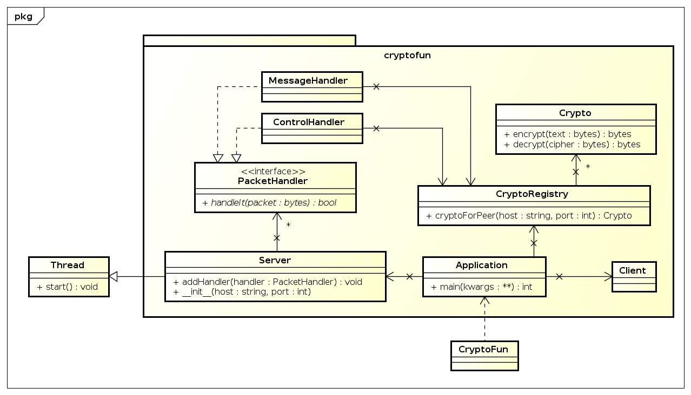

#########
CryptoFun
#########

Task
====

Kommunikation [12Pkt]
~~~~~~~~~~~~~~~~~~~~~

Programmieren Sie eine Kommunikationsschnittstelle zwischen zwei Programmen
(Sockets; Übertragung von Strings). Implementieren Sie dabei eine unsichere
(plainText) und eine sichere (secure-connection) Übertragung.

Bei der secure-connection sollen Sie eine hybride Übertragung nachbilden. D.h.
generieren Sie auf einer Seite einen privaten sowie einen öffentlichen
Schlüssel, die zur Sessionkey Generierung verwendet werden. Übertragen Sie den
öffentlichen Schlüssel auf die andere Seite, wo ein gemeinsamer Schlüssel für
eine synchrone Verschlüsselung erzeugt wird. Der gemeinsame Schlüssel wird mit
dem öffentlichen Schlüssel verschlüsselt und übertragen. Die andere Seite kann
mit Hilfe des privaten Schlüssels die Nachricht entschlüsseln und erhält den
gemeinsamen Schlüssel.

Sniffer [4Pkt]
~~~~~~~~~~~~~~

Schreiben Sie ein Sniffer-Programm (Bsp. mithilfe der jpcap-Library
http://jpcap.sourceforge.net oder jNetPcap-Library http://jnetpcap.com/),
welches die plainText-Übertragung abfangen und in einer Datei speichern kann.
Versuchen Sie mit diesem Sniffer ebenfalls die secure-connection anzuzeigen.

Info
~~~~

Gruppengröße: 2 Mitglieder
Punkte: 16

* Erzeugen von Schlüsseln: 4 Punkte
* Verschlüsselte Übertragung: 4 Punkte
* Entschlüsseln der Nachricht: 4 Punkte
* Sniffer: 4 Punkte

Cryptographic library
=====================

We used the python library libnacl. 
With it you can create a public and private key with following method:

bob = libnacl.public.SecretKey()

In the variable bob is now a public and private key. To get only
the public key you can use following method:

bob.hex_pk() 

This will return only the public key which can now be used to send it
to Person B.

Design
======

Protocol
~~~~~~~~

To keep our protocol simple we will use terminated strings as our base concept.
Messages are terminated by an instance of the ASCII
"End Transmission Block character", 0xC0.

Control streams
~~~~~~~~~~~~~~~

Normal text messages are not the only thing that has to be transmitted between
multiple instances of the application, for example cryptographic keys have to
be transmitted too. For these control information, packets preceded with the
character "Start of Heading", 0x01 are used.

CONNECT
-------

Starts a session. The host and port the application is listening is appended
after the "CONNECT" and a space.

INIT_PUB
--------

Starts an asymmetrical encrypted session. The public key is appended after the
"INIT_PUB" and a space.

INIT_SHARED
-----------

Starts a symmetrical encrypted session. The key has to be transmitted
manually since it is not advisable to send it over an unencrypted
connection.

INIT_HYBRID
-----------
Starts a symmetrical encrypted session. The key is encrypted with the
receivers public key and appended after the "INIT_HYBRID" and a space.

UML
~~~

Effort estimate
===============

================================ ========
Task                             Estimate
================================ ========
Evaluation of crypto libraries    02:00
Protocol design                   02:00
Application design                02:00
Documentation                     02:00
Implementation                    04:00
Testing                           02:00
================================ ========

Time recording
==============

Jakob Klepp
~~~~~~~~~~~

================================ ========== ===== ===== =========
Task                             Date       From  To    Duration
================================ ========== ===== ===== =========
Starting documentation           2015-01-28 10:10 10:50   00:40
Application design (UML)         2015-01-28 19:00 19:50   00:50
Protocol design                  2015-01-29 12:30 13:00   00:30
socket prototyping               2015-01-29 13:00 14:15   01:15
**Total**                                               **03:15**
================================ ========== ===== ===== =========

Andreas Vogt
~~~~~~~~~~~~

================================ ========== ===== ===== =========
Task                             Date       From  To    Duration
================================ ========== ===== ===== =========
Testing Ptyhon Libary libnacl    2015-01-28 19:00 20:00   01:00
**Total**                                               **00:00**
================================ ========== ===== ===== =========

Bibliography
============

.. _1:

[1]  "libnacl: Python bindings to NaCl",
     https://libnacl.readthedocs.org/en/latest/
     last visited: 2015-01-28

.. _2:

[2]  "NaCl: Networking and Cryptography library",
     http://nacl.cr.yp.to/
     last visited: 2015-01-28

.. _3:

[3]  "Python 3.4.2 Documentation: socket — Low-level networking interface",
     https://docs.python.org/3/library/socket.html
     last visited: 2015-01-28

.. header::

    +-------------+---------------+------------+
    | Title       | Author        | Date       |
    +=============+===============+============+
    | ###Title### | Andreas Vogt  | 2015-01-30 |
    |             | — Jakob Klepp |            |
    +-------------+---------------+------------+

.. footer::

    ###Page### / ###Total###
